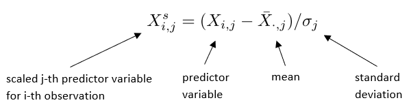
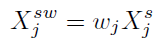
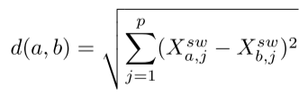
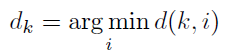
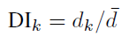

Author: [@GitLiliana](https://github.com/GitLiliana)

Issue: [#5](https://github.com/Geosoft2/geosoft2-2021/issues/5)

# Area of Applicability - Theory

This handout aims to summarise the preprint paper 'Predicting into unkown space? Estimating the area of applicability of spatial prediction models' by [Meyer and Pebesma (2020)](https://arxiv.org/abs/2005.07939) with focus on motivation and methodology.

## Motivation

Spatial mapping of environmental variables is important to reveal spatial patterns and changes of the environment. A common method in this context is the predictive modelling using machine learning algorithms as the relationships between environmental variables are complex. On the basis of field data statistical models are trained to make predictions for the entire area of interest which is quite often on a global scale. The field data normally is not evenly distributed and does not cover the entire study area. Nevertheless predictions are often made for areas which lack training data. This is especially problematic for heterogenous landscapes which might differ considerably in its properties from what has been observed in the training data. It might lead to areas for which the model does not give reliable predictions because it has no knowledge about them. This arises the following questions:
1. What is the model's area of applicability (AOA)?
2. How can the area of applicability be estimated?
 

## Methodology

### Basic Idea

1. **Calculate dissimilarity index (DI):** As differences between areas play an important role in the applicability of a model, an index which describes the dissimilarity between data points is calculated. This is the so called 'dissimilarity index'. It is based on the minimum distance to the training data within the multidimensional predictor space using weighed predictor variables.
2. **Estimating the AOA by applying threshold of the DI:** The threshold of the DI is derived from comparison between the prediction error within the AOA and the cross-validation error of the model.

### Calculating the Dissimilarity Index (DI)

1. **Standardization of predictor variables:** To ensure that all variables are treated equally they are scaled by the following formula.

   

2. **Weighing of variables:** To reflect the variable importance the scaled variables are multiplied with an importance estimate wj which is provided by most machine learning models.

   

3. **Distance calculation:** The distance between two points a and b in the predictor variable space is calculated using the Euclidean distance.

   

4. **Minimum distance for a prediction point:** For a new prediction point k, the distance to the nearest training data point is determined by the following formula.

   

5. **Obtain dissimilarity index:** Standardize the minimum distances by deviding dk by the average of pairwise distances in the training data.

   

### Estimating the Area of Applicability

- **Taking cross validation into account:** The AOA is defined as the area where the prediction error is comparable to the model's cross-validation error. Using cross-validation means that the training data is split into folds. This has to be taken into account for calculating the DI. When calculating the distance to the nearest training data point, it is important to only use points that are not in the same fold.
- **Simulate a response variable for testing purposes:** To choose a reasonable threshold for the DI varying thresholds were tested for nearly 1000 prediction tasks where true vaulues were known. Based on bioclimatic predictor variables a spatially continous response variable was simulated. This simulated response variable was then used for the prediction tasks mentioned before.
- **Compare prediction error and cross-validation error for varying quantiles of DI:** Based on the simulations the prediction error was computed by substracting predicted values from true values. Then the prediction error was compared to the cross-validation error for varying quantiles of the DI.
- **Choosing a threshold for DI:** The comparison above showed that the difference between the errors is close to zero for the .95 quantile. Hence, the .95 quantile was selected as threshold for the DI.

## Results from Case Study

Finally, the introduced approach for estimating the AOA is illustrated in a case study using a single simulation for the response variable as shown in figure 5. In addtion, 50 sample points were randomly selected as training data (figure 5b).

   

Based on this, model performance estimations were done. The results are summarized in Figure 7 where the areas outside of the AOA are shown in pink in figure 7e. When comparing the true prediction error with the standard deviation of predictions and the DI, it becomes clear that the DI reflects the true error quite well whereas the standard deviation does not. This emphasises the suitability of the decribed method to estimate the AOA.

   

*(Notice: The paper discusses a second example.)*

## Selected Discussion Questions

- Which source of uncertainty is considered by the DI? Which are not?
- How can the estimation of the AOA be helpful for future sampling campaigns?
- Does the presented approach for estimating the AOA work for various sampling designs and cross-validation strategies? What does this imply for future research?
- Is the .95 quantile of the DI always a good choice for the threshold? What does this imply for future research?

## References

[Meyer, H. and Pebesma, E. (2020): Predicting into unkown space? Estimating the area of applicability of spatial prediction models. Preprint](https://arxiv.org/abs/2005.07939)
